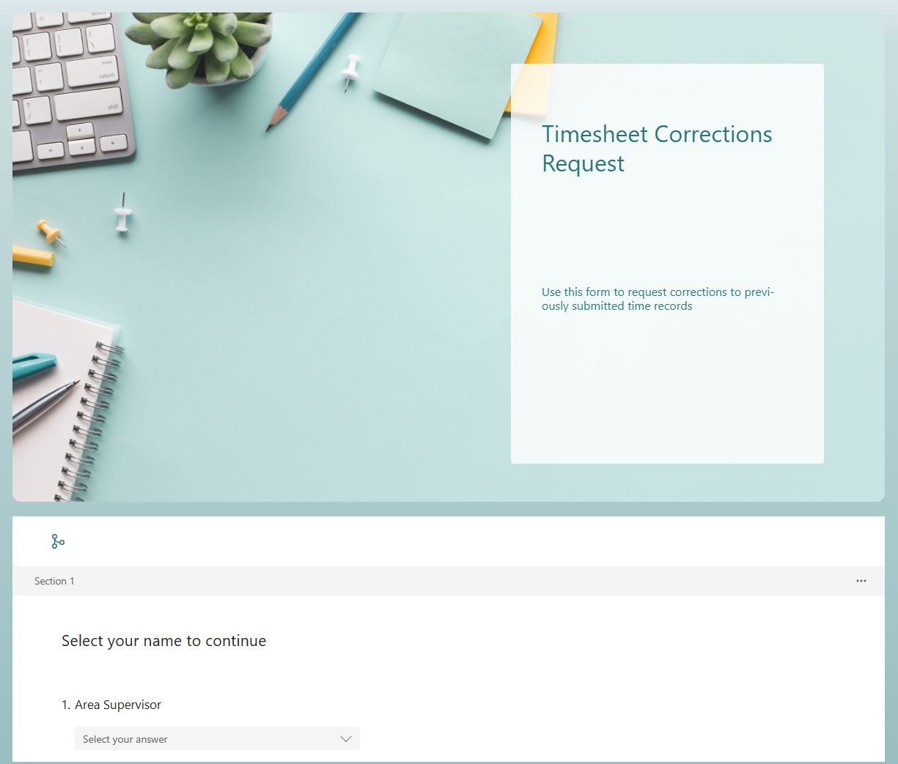
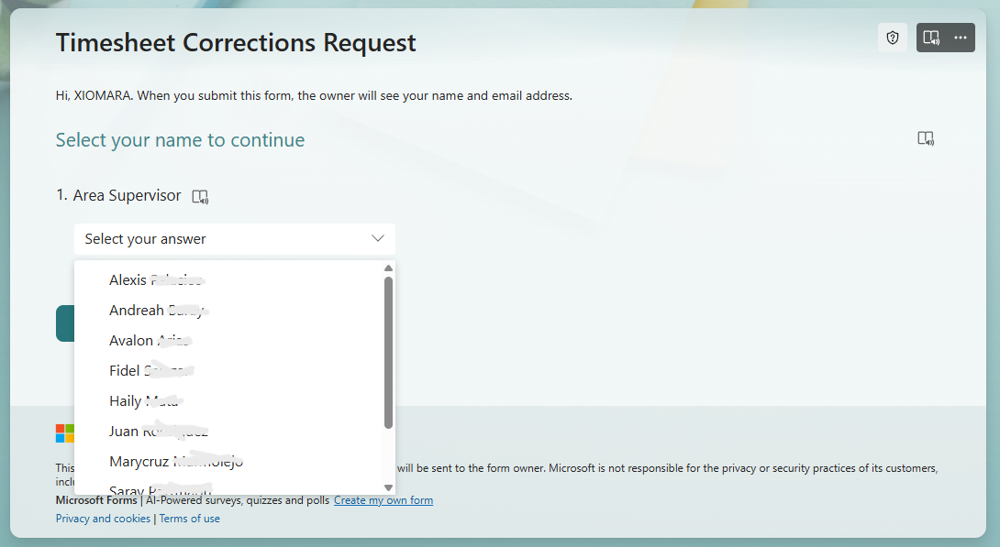
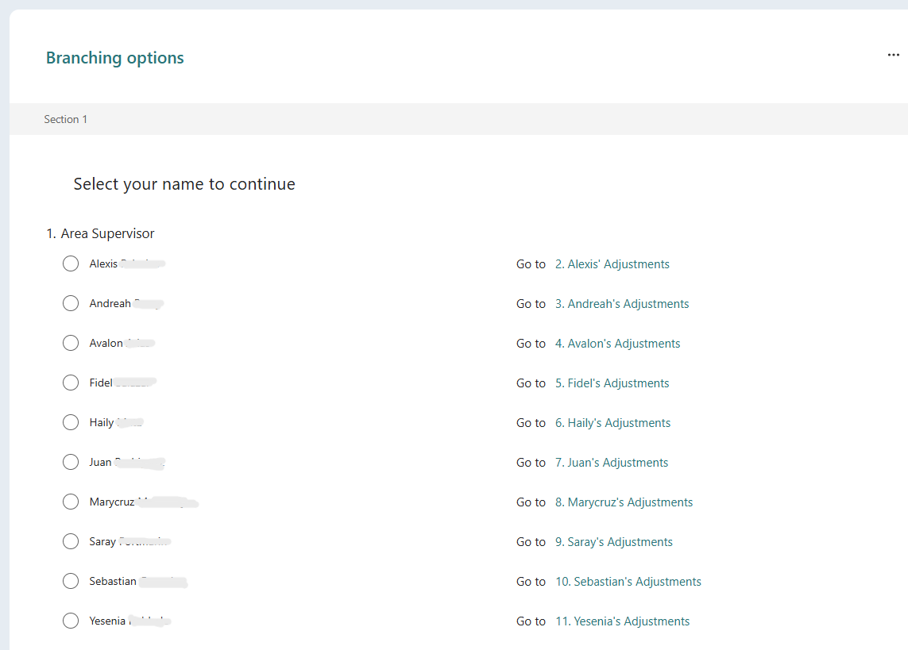
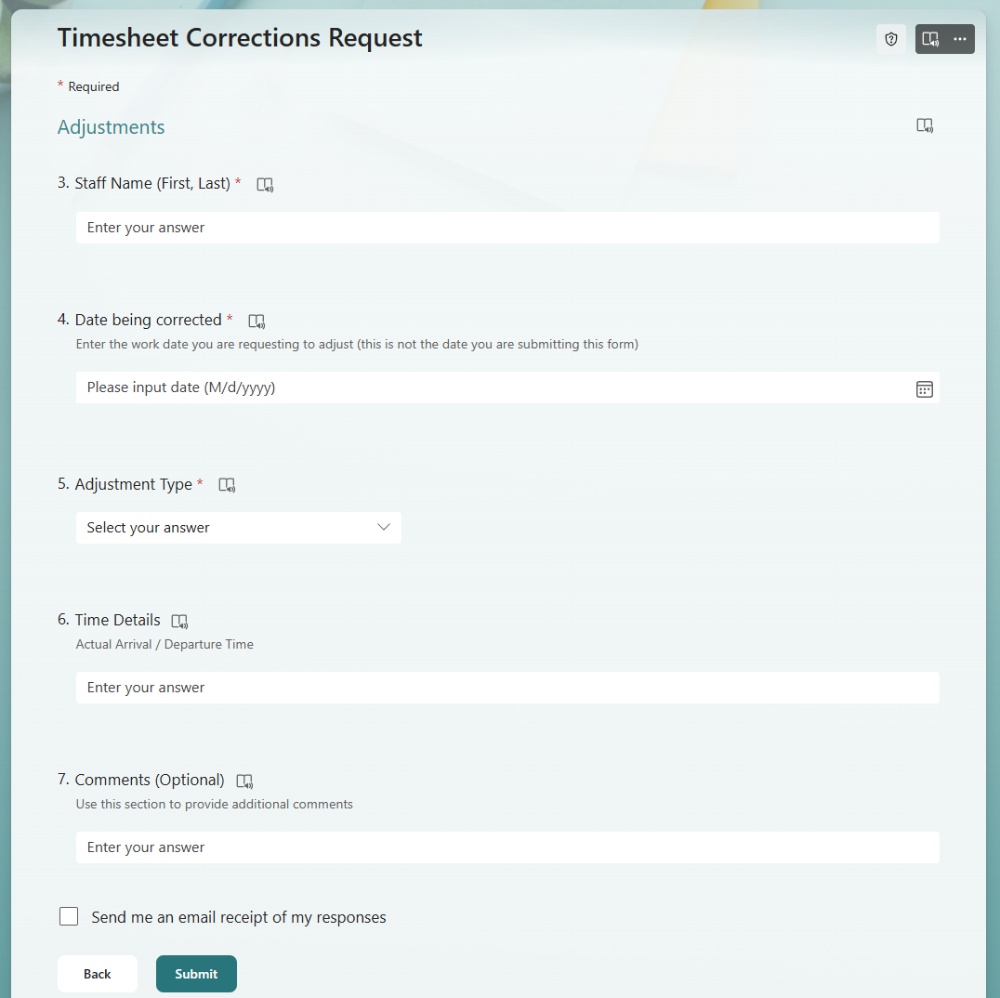
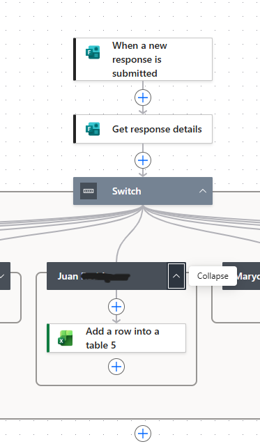
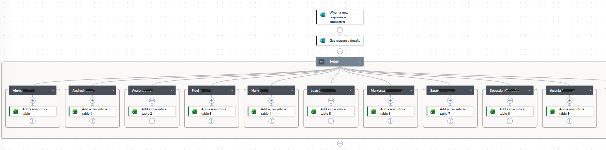
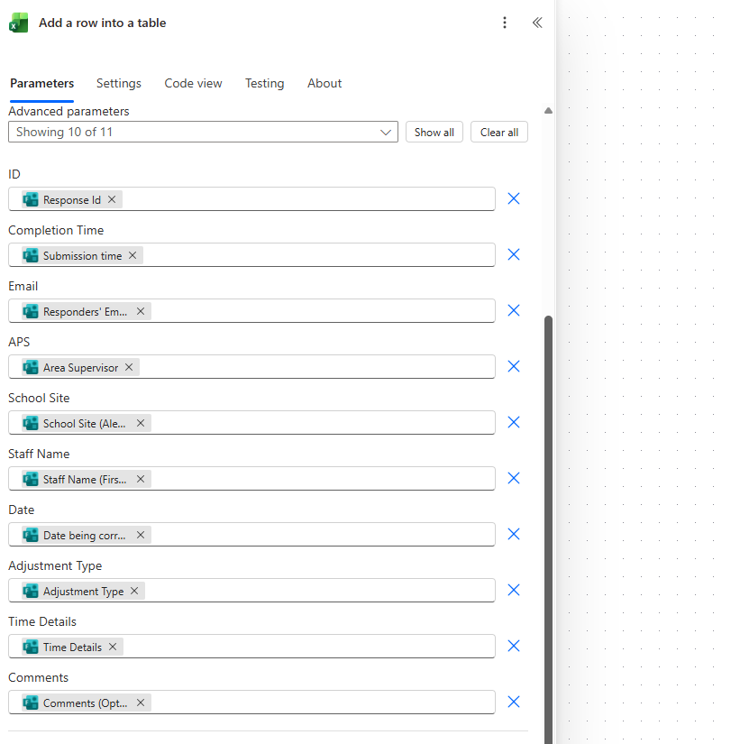
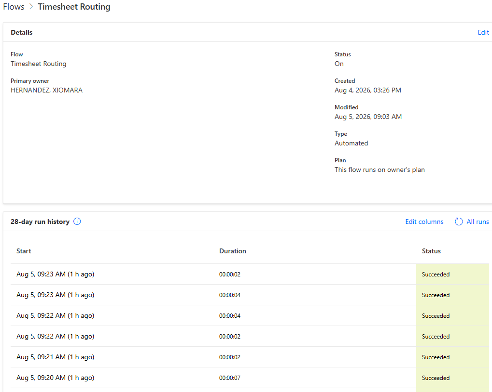
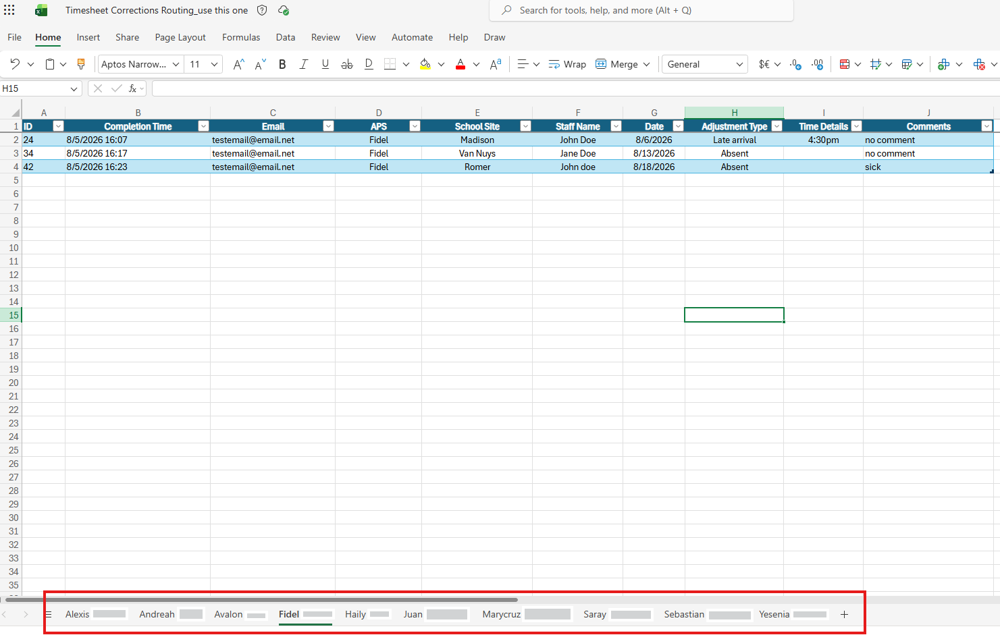

# Automated-Timesheet-Routing-System

## Overview

This project automates the collection, routing, 
and tracking of employee timesheet correction 
requests using Microsoft Forms, Power Automate,
and Excel Online.

Area Supervisors submit correction requests 
through a centralized Microsoft Form. Power 
Automate evaluates the selected Area Supervisor 
and automatically routes the submission to the 
corresponding Excel worksheet + Tab for tracking 
and processing.

## Technologies Used

- Microsoft Forms
- Power Automate
- Excel Online (Business)
- Microsoft 365
- Workflow Automation
- Conditional Logic
- Data Routing

---

## Problem

Timesheet correction requests were collected 
manually and required additional effort to 
organize by Area Supervisor.

Challenges:

- Manual sorting of requests
- Duplicate data entry
- Increased processing time
- Difficulty tracking requests by supervisor
- Higher risk of human error

---

## Solution Architecture (screenshots)

A Microsoft Form intake solution was created
to collect payroll adjustment requests.

The workflow diagram:

1. Microsoft Forms is accessed
2. User selects an Area Supervisor (self).
3. Form's branching directs users to the appropriate
   section (their cluster of schools).
4. User completes the adjustment request.
5. Power Automate retrieves the form response.
6. A Switch condition evaluates the selected Area Supervisor.
7. Data is automatically written to the correct Excel table + Tab.
8. Requests are then organized by supervisor.

---

### Microsoft Forms

### Supervisor Selection
User selects an Area Supervisor (self).

### Branching Logic
Form's branching directs users to the appropriate section (their cluster of schools).

### Adjustment Form Fields
User completes the adjustment request.

### Power Automate Flow
Power Automate retrieves the form response.

### Switch Routing Logic
A Switch condition evaluates the selected Area Supervisor.

### Data Mapping

### Successful Execution

### Final Output
Data is automatically written to the correct Excel table + Tab.

